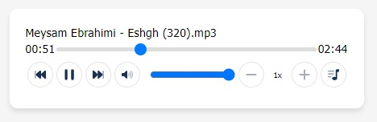

> # **Warning**: `This package is currently being tested. Please do not use it for now`



# for seek audio file in chrome

## IIS web.config

```
<system.webServer>
  <httpProtocol>
    <customHeaders>
      <add name="Accept-Ranges" value="bytes" />
    </customHeaders>
  </httpProtocol>
</system.webServer>
```

## Appache .htaccess

```
<IfModule mod_headers.c>
    Header set Accept-Ranges bytes
</IfModule>
```

## NginX nginx.conf

```
http {
    server {
        location / {
            add_header Accept-Ranges bytes;
        }
    }
}
```
